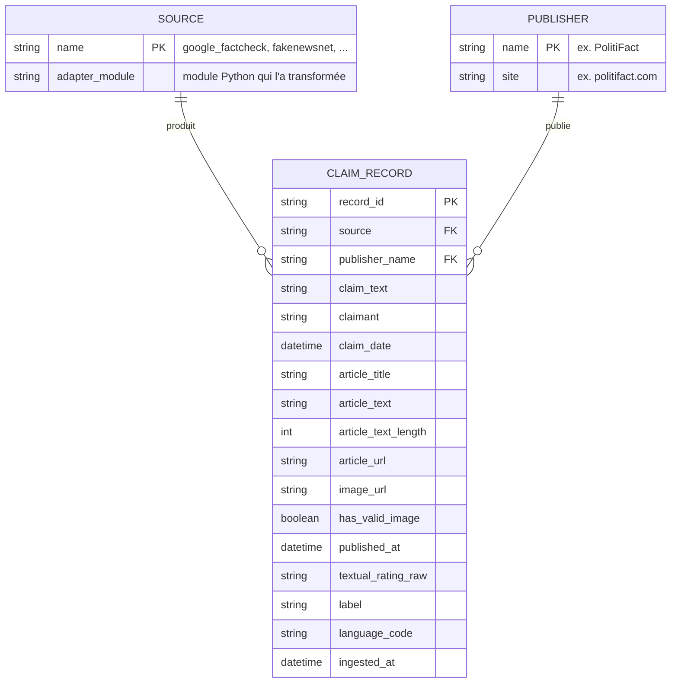

# Schéma conceptuel — dataset transformé

Modèle de données produit par `src/pipeline` à partir de n'importe
quelle extraction (Google Fact Check, FakeNewsNet, et toute source future
disposant d'un adaptateur). Chaque ligne du dataset final correspond à une
`CLAIM_RECORD`, rattachée à une `SOURCE` (l'extraction d'origine) et,
lorsque l'information existe, à un `PUBLISHER` (l'organisme de vérification).

## Modèle entité-relation

## Champs, types et rôle pour l'usage IA

| Champ | Type | Rôle | Description |
| --- | --- | --- | --- |
| `record_id` | string | Identifiant | Id stable, dérivé de `source` + `article_url` (hash SHA-1 tronqué) |
| `source` | string | Provenance | Nom de l'extraction d'origine (`google_factcheck`, `fakenewsnet`, ...) |
| `claim_text` | string | **Texte NLP** | Affirmation vérifiée — entrée principale pour un modèle de classification |
| `claimant` | string \| null | Métadonnée | Auteur/origine de l'affirmation |
| `claim_date` | datetime \| null | Métadonnée temporelle | Date de l'affirmation |
| `article_title` | string \| null | **Texte NLP** | Titre de l'article de vérification |
| `article_text` | string \| null | **Texte NLP** | Corps complet de l'article — contexte enrichi pour le NLP |
| `article_text_length` | int | Métadonnée dérivée | Longueur de `article_text` (0 si absent) — utile pour filtrer le bruit |
| `article_url` | string \| null | Provenance | URL de l'article, pour audit/traçabilité |
| `image_url` | string \| null | **Image multimodale** | URL d'image associée, quand la source en fournit (ex. Fakeddit) |
| `has_valid_image` | boolean | Image multimodale (dérivé) | Vérification syntaxique de `image_url` (hors ligne, pas de requête réseau) |
| `publisher_name` | string \| null | Métadonnée | Organisme de fact-checking |
| `publisher_site` | string \| null | Métadonnée | Domaine du publisher |
| `published_at` | datetime \| null | Métadonnée temporelle | Date de publication de la vérification |
| `textual_rating_raw` | string \| null | Provenance / audit | Évaluation textuelle brute avant normalisation (traçabilité du mapping) |
| `label` | `"fake"` \| `"true"` | **Cible de classification** | Label binaire normalisé — variable à prédire |
| `language_code` | string \| null | Métadonnée | Code langue |
| `ingested_at` | datetime | Provenance | Horodatage du passage dans le pipeline (reproductibilité/audit) |

## Notes de conception

- **Adaptable** : les colonnes ci-dessus forment le schéma *canonique* — commun
  à toutes les sources. Chaque source a son propre adaptateur
  (`pipeline/adapters/<source>.py`) qui traduit ses colonnes brutes vers ce
  schéma ; le nettoyage, la validation et l'export ne changent jamais.
- **`label` vs `textual_rating_raw`** : `label` est la cible d'entraînement
  (binaire, propre) ; `textual_rating_raw` est conservé pour l'audit — pouvoir
  vérifier a posteriori pourquoi une ligne a été classée `fake` ou `true`.
- **`image_url` reste dans le schéma** même si Google Fact Check n'en fournit
  plus (colonne à `null`), pour que les sources multimodales (Fakeddit) puissent
  s'y brancher sans modifier le schéma.
- **Reproductibilité** : `has_valid_image` est une vérification syntaxique
  (extension de fichier), volontairement hors ligne — une vérification réseau
  rendrait la sortie du pipeline dépendante de l'état d'internet au moment de
  l'exécution.
